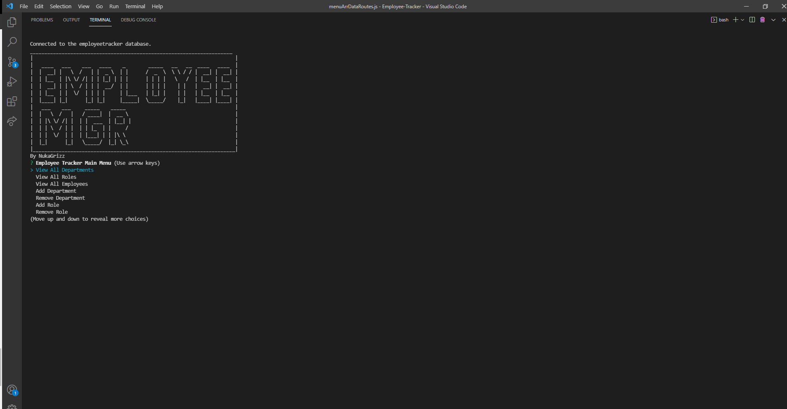

# Employee-Tracker

  
  ## Description 

  A employee management sytem keeping a editable record of all employees, including thier salaries, roles, deparments, names, and id's.
  
  ## Table of Contents
  
  * [Installation](#installation)
  * [Usage](#usage)
  * [Contributing](#Contributing)
  * [License](#license)
  * [Tests](#tests)
  * [Questions](#questions)
  
  ## Installation
  
  To install download or clone the files from the repository and open them in vs code. Then from the root directory run 'npm init' followed by 'npm install inquirer' 'npm install express' 'npm install mysql2' 'npm install console.table --save' in the command line
  
  ## Usage 
  
  To use this program complete the istallation instructions and from the root directory run 'npm start' in the terminal command line.

  ## Walkthrough Video & ScreenShot

  https://drive.google.com/file/d/1NlwZAZUuIESlWrxZBjd1MY15tYHITM-9/view?usp=sharing
  
  
  
  ## License
  
  Licensed under the [MIT License](https://choosealicense.com/licenses/mit/)
  
  ## Contributing
  
  Anyone is allowed to contribute to this open source project. See the License section for specifics
  
  ## Tests
  
  To test this project install jest by running 'npm install jest' and then running 'npm run test'

  ## Questions

  For questions please reachout

  GitHub: [NukaGrizz](https://github.com/NukaGrizz)

  Email: nukagrizz@gmail.com
